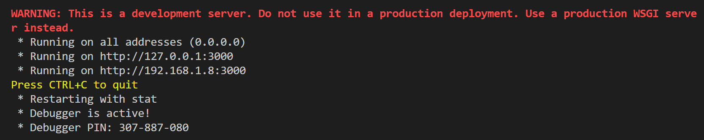
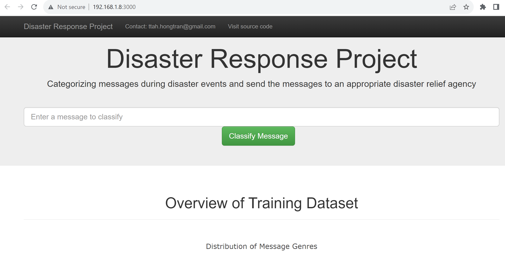

# Disaster Response Pipeline Project

### Table of Contents

1. [Installation](#installation)
2. [Project Description](#description)
3. [File Structure](#files)
4. [Instructions to run source code](#instruction)
5. [Licensing, Authors, and Acknowledgements](#licensing)

## Installation <a name="installation"></a>

- Beyond the Anaconda distribution of Python, there are several libraries needed to be installed: `sqlalchemy`, `nltk`, `sklearn`, `pickle`, `flask`, `joblib`
- The code should run with no issues using Python versions 3.*. Currently using Python `3.11.3`

## Project Description<a name="description"></a>

<p>During disaster events like earthquake, volcano, floods, etc, there are several messages sent by people who are suffering from disasters and need emergency aid. This project is to create an app that use a machine learning pipeline to categorize these messages so that you can send the messages to an appropriate disaster relief agency.</p>

The dataset is provided by [Figure Eight](https://appen.com/)

Process to facilitate this project:
- Build an ETL pipeline ([process_data.py](https://github.com/hongtranthianh/Disaster-Response-Pipeline/blob/main/data/process_data.py)) to read the dataset, clean the data, and then store it in a SQLite database
- Build an ML pipeline ([train_classifier.py](https://github.com/hongtranthianh/Disaster-Response-Pipeline/blob/main/models/train_classifier.py)) that take the `message` column as input and output classification results on the other 36 categories in the dataset based on [MultiOutputClassifier](http://scikit-learn.org/stable/modules/generated/sklearn.multioutput.MultiOutputClassifier.html)
- Build a Flask web app to display the result

## File Structure <a name="files"></a>


```
- app
| - template
| |- master.html  # main page of web app
| |- go.html  # classification result page of web app
|- run.py  # Flask file that runs app

- data
|- disaster_categories.csv  # data to process 
|- disaster_messages.csv  # data to process
|- process_data.py # ETL pipeline
|- DisasterResponse.db   # database to save clean data to

- models
|- train_classifier.py # ML pipeline
|- classifier.pkl  # saved model 

- README.md
```

## Instructions to run source code<a name="instruction"></a>

1. Run the following commands in the project's root directory to set up your database and model.

  - Run ETL pipeline that cleans data and stores in database
    ```
    python data/process_data.py data/disaster_messages.csv data/disaster_categories.csv data/DisasterResponse.db
    ```

  - Run ML pipeline that trains classifier and saves
    ```
    python models/train_classifier.py data/DisasterResponse.db models/tuned_model.pkl
    ```

2. Go to `app` directory
```
cd app
```

3. Run web app
```
python run.py
```

The running result should look like this image
<p ></p>

4. Click the `http://192.168.1.8:3000/` to open the homepage

Here is a screenshort of the web app
<p ></p>


## Licensing, Authors, Acknowledgements<a name="licensing"></a>

Free to use the data and the code here as you would like.

